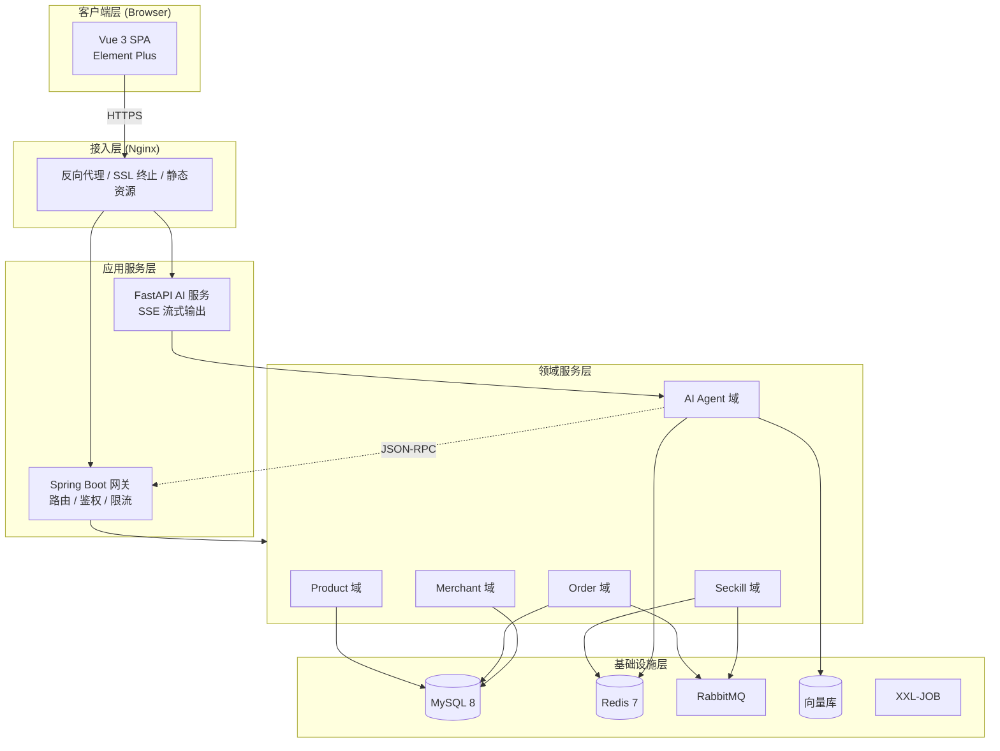
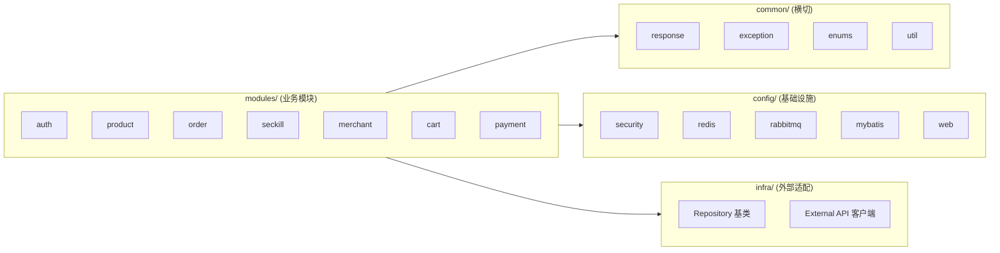
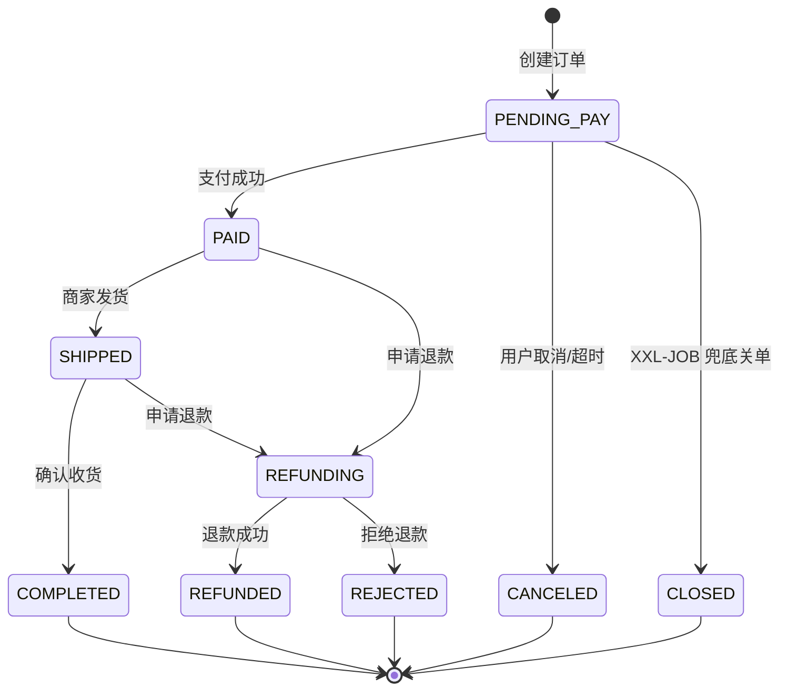
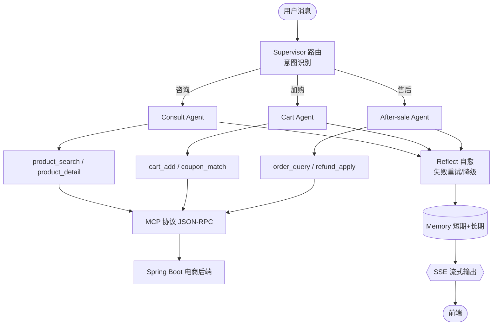
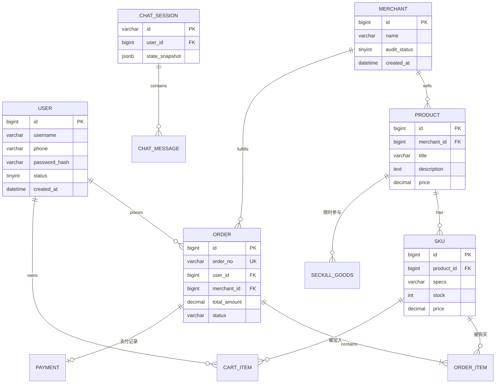

# 智能电商平台 + AI 导购助手

一个前后端分离的**智能电商平台**单体 + 独立的 **AI 导购助手** 服务组成的 monorepo：

- **智能电商平台**：Vue 3 前端 + Spring Boot 3 后端，覆盖用户/商户双角色、商品、购物车、订单、支付、秒杀、商家入驻。
- **AI 导购助手**：Python（FastAPI + LangGraph）多 Agent 服务，通过 MCP 协议调用电商后端，提供商品咨询 / 加购 / 售后能力，SSE 流式输出。

---

## 技术栈

| 层 | 智能电商平台 | AI 导购助手 |
| --- | --- | --- |
| 接入层 | Nginx / OpenResty | Nginx / OpenResty |
| 前端 | Vue 3 + Vite + TS + Pinia + Element Plus | （与前端共用） |
| 后端框架 | Spring Boot 3.x + Spring Security 6 | FastAPI 0.115+ |
| 数据访问 | MyBatis-Plus + MySQL 8 + Redis 7 + Redisson | SQLAlchemy 2 + MySQL 8 + Redis 7 |
| 消息 / 异步 | RabbitMQ + XXL-JOB | Celery / 异步任务 |
| AI 编排 | — | LangGraph + LangChain + Tool Calling |
| 检索 / 记忆 | — | RAG（向量库）+ 短期 / 长期记忆 |
| 流式响应 | — | SSE（Server-Sent Events） |
| 部署 | Docker + docker-compose（本地）/ K8s（生产） | 同左 |

---

## 系统架构

### 总体分层架构



> AI 服务通过 **MCP 协议**（JSON-RPC）复用 Spring Boot 暴露的商品 / 订单工具，不重复实现业务；同步调用走 MCP，异步事件（下单、支付回调、库存变更）走 RabbitMQ；流式输出用 **SSE**（轻量、自动重连、代理友好）而非 WebSocket。

### 后端（Java）模块架构

按 **feature-first** 划分业务模块；`common` / `config` / `infra` 为横切关注点。



### 订单状态机



### AI 多 Agent 路由工作流

一个 **Supervisor 路由智能体** + 三个**子链智能体**（Consult / Cart / After-sale）。Supervisor 做意图识别并分发；子链各自调用 MCP 工具后进入统一的 **Reflect 自愈** 环节（失败重试，达上限则优雅降级），最终经 SSE 流式返回。



> 无法归类或与购物无关的消息（intent = unknown）默认交由 Consult 智能体兜底处理。

### 核心 ER 关系



---

## 目录结构

```
.
├── backend/                 Spring Boot 3 后端 (Java)
│   ├── src/main/java/com/ecommerce/   业务模块 + common/config/infra
│   ├── src/main/resources/            application.yml / dev / prod
│   ├── sql/                           Flyway 迁移 (V1/V2)
│   └── pom.xml
├── ai-assistant/            Python AI 导购助手 (FastAPI + LangGraph)
│   ├── app/
│   │   ├── main.py         FastAPI 入口
│   │   ├── core/           配置 / 日志 / 安全
│   │   ├── api/v1/         路由 (chat / tools / health)
│   │   ├── agents/         LangGraph 编排 (supervisor + 3 子链 + reflect)
│   │   ├── tools/          MCP 工具层
│   │   ├── memory/         短期 / 长期记忆
│   │   ├── llm/            LLM 客户端 + Prompt
│   │   ├── rag/            检索增强
│   │   ├── schemas/        Pydantic 模型
│   │   └── middleware/     中间件 (trace / error)
│   ├── tests/
│   └── requirements.txt
├── frontend/               Vue 3 前端
│   ├── src/
│   │   ├── api/            axios 实例 + 按模块 API 客户端
│   │   ├── stores/         Pinia 状态 (user / cart / theme)
│   │   ├── router/         路由 + 守卫
│   │   ├── views/          页面级组件
│   │   ├── components/     通用组件
│   │   ├── composables/    组合式函数
│   │   ├── types/          全局类型
│   │   └── utils/          工具
│   └── vite.config.ts
├── docs/
│   └── mysql-schema.sql    全量建库建表 DDL + 演示种子数据
└── docker-compose.dev.yml  本地 MySQL/Redis/RabbitMQ/Milvus/XXL-JOB
```

---

## 本地快速开始

**前置**：JDK 17、Node.js ≥ 20.x、Python 3.11+、Docker Desktop。

```bash
# 1. 启动基础设施 (MySQL / Redis / RabbitMQ / Milvus / XXL-JOB)
docker compose -f docker-compose.dev.yml up -d

# 2. 后端 Spring Boot (自动执行 Flyway V1+V2 建表, 监听 :8080, Swagger: /swagger-ui.html)
cd backend && ./mvnw spring-boot:run -Dspring-boot.run.profiles=dev

# 3. AI 助手 Python (API :8000, OpenAPI: /docs, 健康检查: /api/v1/health)
cd ai-assistant
python -m venv .venv && source .venv/bin/activate     # Windows: .venv\Scripts\activate
pip install -r requirements.txt
cp .env.example .env                                   # 填入 LLM API Key 等
uvicorn app.main:app --reload --port 8000

# 4. 前端 Vue 3 (→ http://localhost:5173)
cd frontend && npm install && npm run dev
```

### 测试账号

| 角色 | 用户名 | 密码 |
| --- | --- | --- |
| 买家 | `buyer1` | `123456` |
| 商户 | `merchant1` | `123456` |
| 禁用账号（用于验证禁用提示） | `zhaoliu` | `123456` |

---

## 认证与角色体系

- **入口即登录**：买家页（`/`、`/search`、`/product/:id` 等）均 `requiresAuth`，未登录跳 `/login`；已登录访问 `/login` 自动回跳对应首页。
- **登录页合一** `frontend/src/views/Login.vue`：`登录 / 注册` Tab；登录先选「商户 / 买家」；注册分商户 / 买家，成功后自动登录并跳对应首页。
- **角色守卫** `frontend/src/router/guard.ts`：角色不匹配跳回自己的首页（商户 → `/merchant/dashboard`，买家 → `/`）。
- **JWT 角色**：access token 写入 `role` 声明，`JwtAuthFilter` 解析后注入权限。登录只校验「用户名 + 密码」，角色由用户记录决定（客户端改不了）。

---

## API 规范

### 统一响应体

```json
{ "code": 0, "message": "ok", "data": { }, "traceId": "abc123" }
```

- 成功 `code = 0`；分页 `data` 含 `list / total / page / pageSize`。
- 失败 `code != 0`，前端拦截器统一弹窗（业务错误即便 HTTP 200 也会提示）。

### 错误码体系

| 范围 | 含义 |
| --- | --- |
| `0` | 成功 |
| `1xxx` | 通用错误（参数 / 系统） |
| `2xxx` | 鉴权 / 权限 |
| `3xxx` | 商品 / 库存 |
| `4xxx` | 订单 / 支付 |
| `5xxx` | 商家 / 入驻 |
| `10xxx` | AI 服务专属 |
| `99999` | 系统兜底 |

常见：`1001` 参数校验失败(422)、`1003` 资源冲突(409)、`2001` 未登录 / token 失效(401)、`2002` 无权限(403)、`2003` 账号已禁用、`3002` 库存不足(409)、`4001` 订单状态不允许(409)、`99999` 系统异常(500)。

### 鉴权

- 登录下发 **access token (15min) + refresh token (7day)**；请求头 `Authorization: Bearer <access_token>`。
- 401 时前端用 refresh token 换新 access token，失败跳登录。
- 跨服务调用（AI → 后端）使用服务内部 token（MCP 协议层校验）。

### 核心 API 清单

| 模块 | 方法 | 路径 | 说明 |
| --- | --- | --- | --- |
| 认证 | POST | `/api/auth/login` | 登录 |
| 认证 | POST | `/api/auth/refresh` | 刷新 token |
| 认证 | GET | `/api/auth/me` | 当前用户 |
| 商品 | GET | `/api/products` | 搜索（多维筛选） |
| 商品 | GET | `/api/products/{id}` | 详情 |
| 商品 | GET | `/api/products/hot` | 热门推荐 |
| 购物车 | GET / POST | `/api/cart` · `/api/cart/items` | 列表 / 加购 |
| 订单 | POST | `/api/orders` | 创建 |
| 订单 | POST | `/api/orders/{id}/cancel` · `/pay` | 取消 / 支付 |
| 秒杀 | POST | `/api/seckill/{skuId}` | 秒杀（Redis + Lua） |
| 商家 | POST / GET | `/api/merchant/apply` · `/audit` | 入驻 / 审核 |
| AI | POST | `/api/v1/chat` | 对话（SSE 流式） |
| AI | POST | `/api/v1/chat/stop` | 中断对话 |
| AI | GET | `/api/v1/chat/sessions` | 历史会话 |
| AI | GET | `/api/v1/health` | 健康检查 |

> AI 对话走 SSE，`data:` 行携带 JSON，类型含 `token`（增量文本）、`tool_call`、`tool_result`、`error`、`done`。

---

## 代码规范

### Git Flow

```
main (生产, 受保护) ← develop (集成, 受保护)
  ├── feature/<scope>-<desc>   功能开发
  ├── release/<version>        发布准备
  └── hotfix/<scope>-<desc>    紧急修复
```

- `main` / `develop` 禁止直接 push，须 PR + 至少 1 名资深开发 approve + CI 通过。
- 强制 Squash Merge；提交遵循 **Conventional Commits**：`feat` / `fix` / `refactor` / `perf` / `test` / `docs` / `style` / `chore`，如 `feat(order): add cancel via delayed queue (#123)`。

### 分层约束（后端）

- `controller` 仅解析参数、调 service、返回响应；`service` 持有业务规则；`repository` 仅数据访问；`entity` 不出 service，对外一律 DTO。
- 外部调用（DB / Redis / HTTP）须捕获异常并转为 `BusinessException`；禁止 `System.out.println`，统一 SLF4J + 结构化日志（含 `traceId`）。
- `@Transactional` 只加在 service 方法上；禁止循环内 SQL / RPC、禁止 `select *`、禁止直接返回 entity。

### 必须遵守（前端 / Python AI）

- **前端**：Composition API + `<script setup lang="ts">`；Props / Emits 显式类型，禁止 `any`；API 调用只走 `src/api/modules/*`；路由懒加载。
- **Python AI**：外部 IO 全异步 `async def`；Pydantic 模型显式 `Field`；Agent 节点单一职责；Tool 统一 `BaseTool` 接口；所有 LLM 调用走 `app/llm/client.py`。

### Code Review 关注点

可读性 · 可测试性 · 边界（空 / null / 并发 / 网络）· 性能（N+1 / 全表扫）· 安全（注入 / XSS / 越权）· 可观测 · 可演进。

---

## 已知问题与安全建议（待后续处理）

1. **refreshToken 存于 `localStorage`**：易遭 XSS 窃取，建议改 `httpOnly + Secure` Cookie。
2. **登录 / 注册无限流**：存在账号枚举与暴力破解风险，建议加 IP / 账号级限流。
3. **`logout` 为 no-op**：token 未服务端失效，建议加黑名单或短有效期 + 刷新吊销。
4. **前端 `vue-tsc` 既有类型错误**：`main.ts`、`theme.ts`、`user.ts`、`Cart.vue`、`Search.vue` 等，与业务修复无关，需另行处理。

---

## 数据库 Schema

完整的建库建表 DDL（用户 / 商家 / 商品 / SKU / 秒杀 / 订单 / 订单项 / 购物车 / 地址 / AI 会话·消息）及演示种子数据见 **[`docs/mysql-schema.sql`](docs/mysql-schema.sql)**。

> 该文件放在 `docs/`（而非 `docs/sql`，后者会被 docker-compose 挂载进 MySQL initdb，与 Flyway 迁移冲突）。后端已通过 Flyway 自动建表，本文件仅作完整参考 / 手动建库用。导入种子数据后，商家看板即可看到真实的「上架商品 / 营业额 / 进行中订单」。
