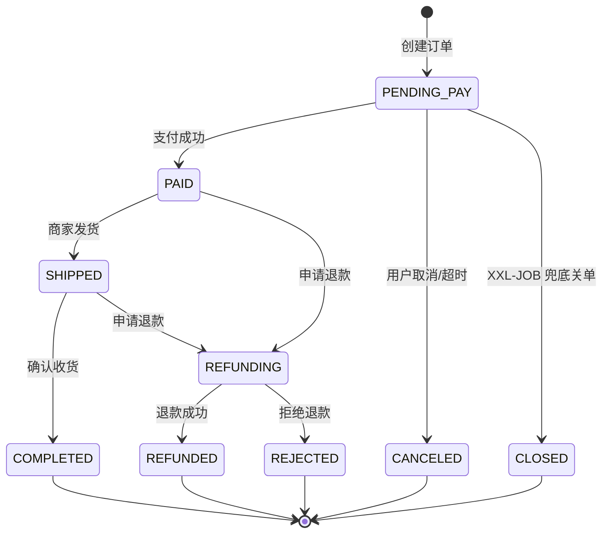
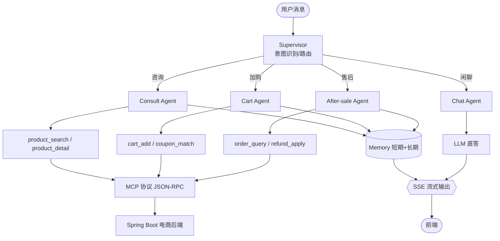
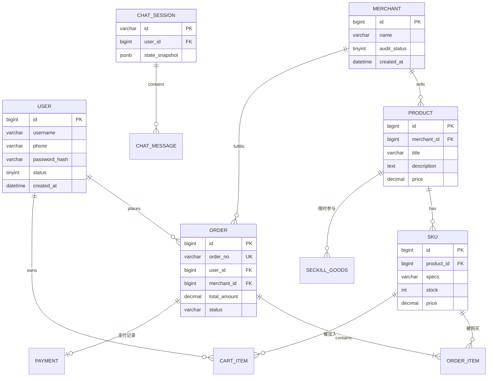

# 智能电商平台 + AI 导购助手

一个前后端分离的**智能电商平台**单体 + 独立的 **AI 导购助手** 服务组成的 monorepo：

- **智能电商平台**：Vue 3 前端 + Spring Boot 3 后端，覆盖用户/商户双角色、商品、购物车、订单、支付、秒杀、商家入驻。
- **AI 导购助手**：Python（FastAPI + LangGraph）多 Agent 服务，通过 MCP 协议调用电商后端，提供咨询 / 加购 / 售后 / 闲聊能力，SSE 流式输出。

---

## 技术栈

| 层 | 智能电商平台 | 智能电商导购 AI 助手 |
| --- | --- | --- |
| 接入层 | Nginx / OpenResty | Nginx / OpenResty |
| 前端 | Vue 3 + Vite + TS + Pinia + Element Plus | （与前端共用） |
| 后端框架 | Spring Boot 3.x + Spring Security 6 | FastAPI 0.115+ |
| 数据访问 | MyBatis-Plus + MySQL 8 + Redis 7 + Redisson | SQLAlchemy 2 + MySQL 8 + Redis 7 |
| 消息 / 异步 | RabbitMQ + XXL-JOB | Celery / 异步任务 |
| AI 编排 | — | LangGraph + LangChain + Tool Calling |
| 检索 / 记忆 | — | RAG（向量库）+ 短期 / 长期记忆 |
| 流式响应 | — | SSE（Server-Sent Events） |
| 部署 | Docker + docker-compose（本地）/ K8s（生产） | 同左 |

---

## 系统架构

### 总体分层架构

```mermaid
flowchart TB
    subgraph Client["客户端层 (Browser)"]
        UI[Vue 3 SPA<br/>Element Plus]
    end
    subgraph Gateway["接入层 (Nginx)"]
        NGINX[反向代理 / SSL 终止 / 静态资源]
    end
    subgraph AppLayer["应用服务层"]
        SB[Spring Boot 网关<br/>路由 / 鉴权 / 限流]
        FA[FastAPI AI 服务<br/>SSE 流式输出]
    end
    subgraph DomainLayer["领域服务层"]
        PROD[Product 域]  ORDER[Order 域]  SEC[Seckill 域]
        MERCH[Merchant 域]  AGENT[AI Agent 域]
    end
    subgraph InfraLayer["基础设施层"]
        MYSQL[(MySQL 8)]  REDIS[(Redis 7)]  MQ[RabbitMQ]
        VEC[(向量库)]  XXL[XXL-JOB]
    end
    UI -->|HTTPS| NGINX
    NGINX --> SB
    NGINX --> FA
    SB --> DomainLayer
    FA --> AGENT
    PROD --> MYSQL
    ORDER --> MYSQL
    ORDER --> MQ
    SEC --> REDIS
    SEC --> MQ
    MERCH --> MYSQL
    AGENT --> VEC
    AGENT --> REDIS
    AGENT -.JSON-RPC.-> SB
```

### 后端（Java）模块架构

按 **feature-first** 划分业务模块；`common` / `config` / `infra` 为横切关注点。

```mermaid
flowchart LR
    subgraph modules["modules/ (业务模块)"]
        AUTH[auth]  PROD[product]  ORDER[order]
        SEC[seckill]  MERCH[merchant]  CART[cart]  PAY[payment]
    end
    subgraph common["common/ (横切)"]
        RES[response]  EX[exception]  EN[enums]  UT[util]
    end
    subgraph config["config/ (基础设施)"]
        SEC_CFG[security]  RD_CFG[redis]  MQ_CFG[rabbitmq]
        MB_CFG[mybatis]  WB_CFG[web]
    end
    subgraph infra["infra/ (外部适配)"]
        REPO[Repository 基类]  EXT[External API 客户端]
    end
    modules --> common
    modules --> config
    modules --> infra
```

### 订单状态机



### AI 多 Agent 路由工作流



### 核心 ER 关系



### 跨服务调用关系

```mermaid
flowchart LR
    subgraph SPA["Vue 3 SPA"]
        V1[商品/购物车/订单页面]
        V2[AI 对话 Chat 页面]
    end
    subgraph SB["Spring Boot"]
        A1[/api/products/.../]  A2[/api/orders/.../]  A3[/api/seckill/.../]  A4[/api/merchant/.../]
    end
    subgraph FA["FastAPI AI 服务"]
        B1[/api/v1/chat SSE/]  B2[/api/v1/tools/invoke/]
    end
    V1 -->|REST/JSON| SB
    V2 -->|SSE| B1
    B1 -->|JSON-RPC over MCP| B2
    B2 -->|HTTPS| SB
```

**关键设计点**

- 前端不直接调用 AI 服务的内部工具接口；AI 服务通过 **MCP 协议** 调用 Spring Boot 暴露的商品 / 订单工具，避免重复实现。
- 流式输出采用 **SSE**（轻量、自动重连、HTTP 友好），而非 WebSocket，简化鉴权与代理穿透。
- Spring Boot 与 AI 服务之间的同步调用走 MCP；异步事件走 RabbitMQ（订单创建、支付回调、库存变更等）。

---

## 目录结构

```
.
├── backend/                 Spring Boot 3 后端 (Java)
│   ├── src/main/java/com/ecommerce/   业务模块 + common/config/infra
│   ├── src/main/resources/            application.yml / dev / prod
│   ├── sql/                           Flyway 迁移 (V1/V2)
│   └── pom.xml
├── ai-assistant/            Python AI 导购助手 (FastAPI + LangGraph)
│   ├── app/
│   │   ├── main.py         FastAPI 入口
│   │   ├── core/           配置 / 日志 / 安全
│   │   ├── api/v1/         路由 (chat / tools / health)
│   │   ├── agents/         LangGraph 编排 (supervisor + nodes)
│   │   ├── tools/          MCP 工具层
│   │   ├── memory/         短期 / 长期记忆
│   │   ├── llm/            LLM 客户端 + Prompt
│   │   ├── rag/            检索增强
│   │   ├── schemas/        Pydantic 模型
│   │   └── middleware/     中间件 (trace / error)
│   ├── tests/
│   └── requirements.txt
├── frontend/               Vue 3 前端
│   ├── src/
│   │   ├── api/            axios 实例 + 按模块 API 客户端
│   │   ├── stores/         Pinia 状态 (user / cart / theme)
│   │   ├── router/         路由 + 守卫
│   │   ├── views/          页面级组件
│   │   ├── components/     通用组件
│   │   ├── composables/    组合式函数
│   │   ├── types/          全局类型
│   │   └── utils/          工具
│   └── vite.config.ts
├── docs/
│   └── mysql-schema.sql    全量建库建表 DDL + 演示种子数据
└── docker-compose.dev.yml  本地 MySQL/Redis/RabbitMQ/Milvus/XXL-JOB
```

---

## 本地快速开始

### 0. 前置条件

- JDK 17、Node.js ≥ 20.x、Python 3.11+
- Docker Desktop（用于本地基础设施）

### 1. 启动基础设施

```bash
docker compose -f docker-compose.dev.yml up -d   # MySQL / Redis / RabbitMQ / Milvus / XXL-JOB
```

### 2. 启动后端（Spring Boot）

```bash
cd backend
./mvnw spring-boot:run -Dspring-boot.run.profiles=dev   # 自动执行 Flyway V1+V2 建表
```

> 需要 JDK 17。后端监听 `http://localhost:8080`，Swagger：`/swagger-ui.html`。

### 3. 启动 AI 助手（Python）

```bash
cd ai-assistant
python -m venv .venv && source .venv/bin/activate      # Windows: .venv\Scripts\activate
pip install -r requirements.txt
cp .env.example .env                                    # 填入 LLM API Key 等
uvicorn app.main:app --reload --port 8000
```

> API：`http://localhost:8000`，OpenAPI：`/docs`，健康检查：`/api/v1/health`。

### 4. 启动前端（Vue 3）

```bash
cd frontend
npm install
npm run dev          # → http://localhost:5173
```

### 测试账号

| 角色 | 用户名 | 密码 |
| --- | --- | --- |
| 买家 | `buyer1` | `123456` |
| 商户 | `merchant1` | `123456` |
| 禁用账号（用于验证禁用提示） | `zhaoliu` | `123456` |

---

## 认证与角色体系

- **入口即登录 / 注册页**：买家页（`/`、`/search`、`/product/:id` 等）均 `requiresAuth`，未登录跳 `/login`；已登录访问 `/login` 自动回跳对应首页。
- **登录页（合一）** `frontend/src/views/Login.vue`：顶部 `登录 / 注册` Tab；登录先选「商户 / 买家」；注册分「商户注册 / 买家注册」，成功后自动登录并跳对应首页。
- **角色守卫** `frontend/src/router/guard.ts`：角色不匹配时跳回自己的首页（商户 → `/merchant/dashboard`，买家 → `/`）。
- **JWT 角色**：access token 写入 `role` 声明；`JwtAuthFilter` 解析后注入权限；`/auth/me` 返回 `roles`。登录只校验「用户名 + 密码」，角色由用户记录决定（客户端改不了）。
- **核心端点**：`POST /api/auth/login`、`POST /api/auth/refresh`、`POST /api/auth/register/{type}`、`GET /api/auth/me`、`GET /api/products/hot`、`GET /api/merchant/dashboard` 等。

---

## API 规范

### 统一响应体

```json
{ "code": 0, "message": "ok", "data": { }, "traceId": "abc123" }
```

- 成功 `code = 0`；分页 `data` 含 `list / total / page / pageSize`。
- 失败 `code != 0`，前端拦截器统一弹窗（业务错误即便 HTTP 200 也会提示）。

### 错误码体系

| 范围 | 含义 |
| --- | --- |
| `0` | 成功 |
| `1xxx` | 通用错误（参数 / 系统） |
| `2xxx` | 鉴权 / 权限 |
| `3xxx` | 商品 / 库存 |
| `4xxx` | 订单 / 支付 |
| `5xxx` | 商家 / 入驻 |
| `10xxx` | AI 服务专属 |
| `99999` | 系统兜底 |

常见：`1001` 参数校验失败(422)、`1003` 资源冲突(409)、`2001` 未登录 / token 失效(401)、`2002` 无权限(403)、`2003` 账号已禁用、`3002` 库存不足(409)、`4001` 订单状态不允许(409)、`99999` 系统异常(500)。

### 鉴权

- 登录下发 **access token (15min) + refresh token (7day)**；请求头 `Authorization: Bearer <access_token>`。
- 401 时前端用 refresh token 换新 access token，失败跳登录。
- 跨服务调用（AI → 后端）使用服务内部 token（MCP 协议层校验）。

### 核心 API 清单

| 模块 | 方法 | 路径 | 说明 |
| --- | --- | --- | --- |
| 认证 | POST | `/api/auth/login` | 登录 |
| 认证 | POST | `/api/auth/refresh` | 刷新 token |
| 认证 | GET | `/api/auth/me` | 当前用户 |
| 商品 | GET | `/api/products` | 搜索（多维筛选） |
| 商品 | GET | `/api/products/{id}` | 详情 |
| 商品 | GET | `/api/products/hot` | 热门推荐 |
| 购物车 | GET / POST | `/api/cart` · `/api/cart/items` | 列表 / 加购 |
| 订单 | POST | `/api/orders` | 创建 |
| 订单 | POST | `/api/orders/{id}/cancel` · `/pay` | 取消 / 支付 |
| 秒杀 | POST | `/api/seckill/{skuId}` | 秒杀（Redis + Lua） |
| 商家 | POST / GET | `/api/merchant/apply` · `/audit` | 入驻 / 审核 |
| AI | POST | `/api/v1/chat` | 对话（SSE 流式） |
| AI | POST | `/api/v1/chat/stop` | 中断对话 |
| AI | GET | `/api/v1/chat/sessions` | 历史会话 |
| AI | GET | `/api/v1/health` | 健康检查 |

### SSE 流式协议

AI 对话走 Server-Sent Events，`data:` 行携带 JSON，类型含 `token`（增量文本）、`tool_call`、`tool_result`、`error`、`done`。

---

## 代码规范

### Git Flow

```
main (生产, 受保护) ← develop (集成, 受保护)
  ├── feature/<scope>-<desc>   功能开发
  ├── release/<version>        发布准备
  └── hotfix/<scope>-<desc>    紧急修复
```

- `main` / `develop` 禁止直接 push，须 PR + 至少 1 名资深开发 approve + CI 通过。
- 强制 Squash Merge，commit message：`feat(order): add cancel via delayed queue (#123)`。

### 提交类型（Conventional Commits）

`feat` / `fix` / `refactor` / `perf` / `test` / `docs` / `style` / `chore`。

### 分层约束（后端）

- `controller` 仅解析参数、调 service、返回响应；`service` 持有业务规则；`repository` 仅数据访问；`entity` 不出 service，对外一律 DTO。
- 外部调用（DB / Redis / HTTP）须捕获异常并转为 `BusinessException`；禁止 `System.out.println`，统一 SLF4J + 结构化日志（含 `traceId`）。
- 事务 `@Transactional` 只加在 service 方法上；禁止循环内 SQL / RPC、禁止 `select *`、禁止直接返回 entity。

### 必须遵守（前端）

- Composition API + `<script setup lang="ts">`；Props / Emits 显式类型，禁止 `any`。
- API 调用只走 `src/api/modules/*`；路由懒加载；禁止 `localStorage` 存敏感信息（token 走 httpOnly cookie）。

### 必须遵守（Python AI）

- 外部 IO 全异步 `async def`；Pydantic 模型显式 `Field`；Agent 节点单一职责；Tool 实现统一 `BaseTool` 接口；所有 LLM 调用走 `app/llm/client.py`。

### Code Review 关注点

可读性 · 可测试性 · 边界（空 / null / 并发 / 网络）· 性能（N+1 / 全表扫）· 安全（注入 / XSS / 越权）· 可观测 · 可演进（开闭原则）。

---

## 修复与变更记录

### 第一轮：前端空白页修复（后端可编译启动 + 补齐端点）

- 新建 `User` / `UserMapper`，补全 `AuthController`（`/me`、`/logout`、`/register/{type}`）、`ProductController`（`/hot`）、JWT 角色、逻辑删除与审计字段自动填充。
- 修复前端 `refresh()` 不传参、`refreshToken` 未落库、AppHeader 图标绑定错误等。

### 第二轮：审计字段 & 逻辑删除补全

- 新建 `AuditMetaObjectHandler`（`MetaObjectHandler`），INSERT 填 `createdAt`+`updatedAt`、UPDATE 刷 `updatedAt`。
- 全实体补 `@TableLogic deleted`，与数据库 `deleted` 列对齐；注册表单补可选手机号。

### 第三轮：登录注册 Bug 修复

| Bug | 根因 | 修复 |
| --- | --- | --- |
| 注册重名前端不弹错 | 后端返回 HTTP 200 + `code=1003`，前端成功分支只 `throw` 不弹窗 | 成功分支 `throw` 前 `ElMessage.error` |
| 注册后登录异常 | 登录校验客户端 `type` 须等于库内 `role`，默认 `BUYER` 误判未登录 | 删除该硬校验，登录只校验用户名 + 密码 |
| 登录成功却 404 | 三处 `request('字符串')` 被当成配置对象，`config.url` 为 undefined，打到 `/api` | `exec` 兼容字符串 URL（一处改，三处全修） |

顺带修复：`AuthServiceImpl` 改用注入的 `PasswordEncoder` Bean；`ResultCode` 新增 `ACCOUNT_DISABLED`；`GlobalExceptionHandler` 新增 `DuplicateKeyException` → `CONFLICT(1003)`（唯一约束并发兜底）。

### 第四轮：Login 页重设计与视觉断裂修复

- `Login.vue` 重写为品牌渐变 + 光晕 + 表单卡片，支持登录 / 注册 Tab、密码显隐、动效与 `prefers-reduced-motion`。
- 修复左右半区视觉断裂（淡紫径向渐变 + 卡片顶部渐变细线 + 右上角光晕呼应）。

---

## 已知问题与安全建议（待后续处理）

1. **refreshToken 存于 `localStorage`**：易遭 XSS 窃取，建议改 `httpOnly + Secure` Cookie。
2. **登录 / 注册无限流**：存在账号枚举与暴力破解风险，建议加 IP / 账号级限流。
3. **`logout` 为 no-op**：token 未服务端失效，建议加黑名单或短有效期 + 刷新吊销。
4. **CSRF 已 `disable()`**：无状态 JWT Bearer 下可接受，但 `withCredentials:true` 配合 cookie 时需谨慎评估。
5. **前端 `vue-tsc` 既有类型错误**：`main.ts` 缺 element-plus 语言包声明、`theme.ts` persister 选项、`user.ts` `includes` 类型、`Cart.vue` / `Search.vue` 等，与本次修复无关，需另行处理。

---

## 数据库 Schema

完整的建库建表 DDL（用户 / 商家 / 商品 / SKU / 秒杀 / 订单 / 订单项 / 购物车 / 地址 / AI 会话·消息）及一份演示种子数据见 **[`docs/mysql-schema.sql`](docs/mysql-schema.sql)**。

> 该文件放在 `docs/`（而非 `docs/sql`，后者会被 docker-compose 挂载进 MySQL initdb，与 Flyway 迁移 `V1/V2` 冲突）。后端已通过 Flyway 自动建表，本文件仅作完整参考 / 手动建库用。

导入种子数据后，商家看板即可看到真实的「上架商品 / 营业额 / 进行中订单」。
