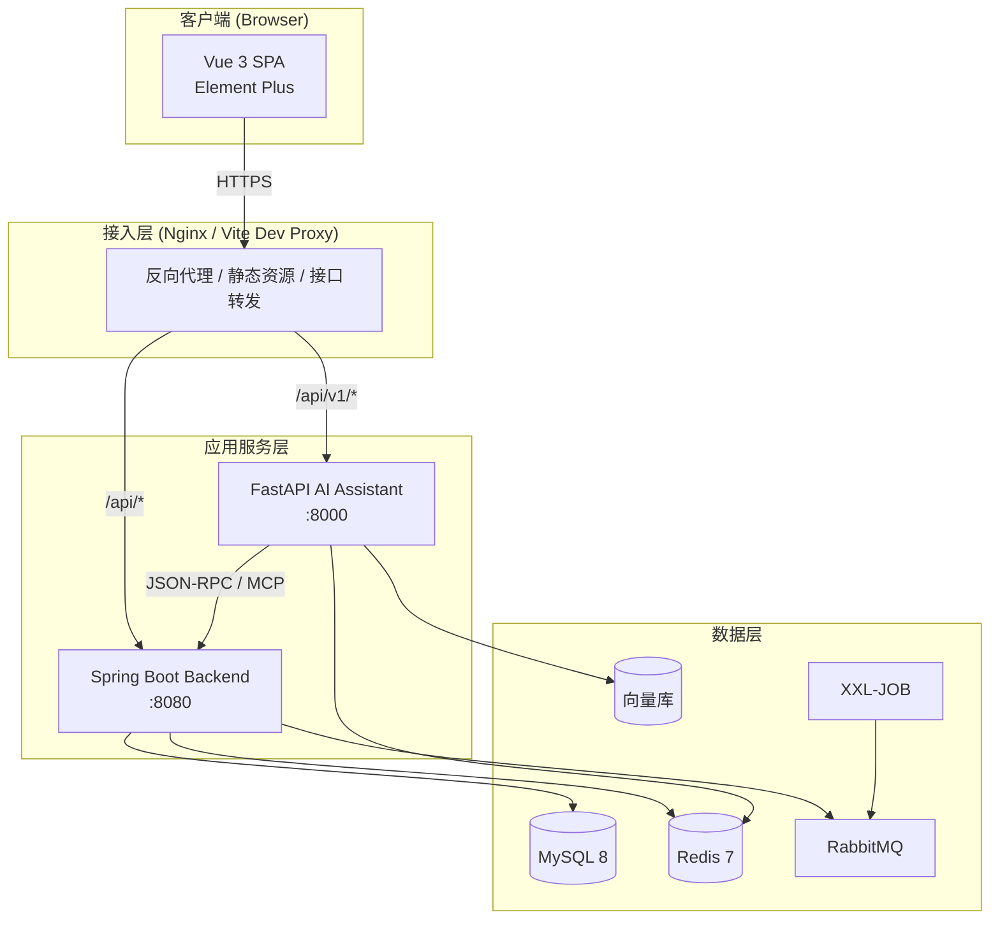
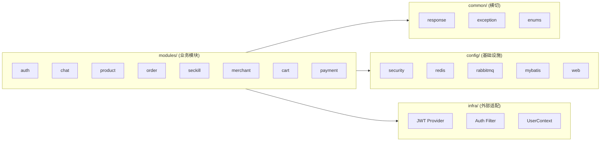
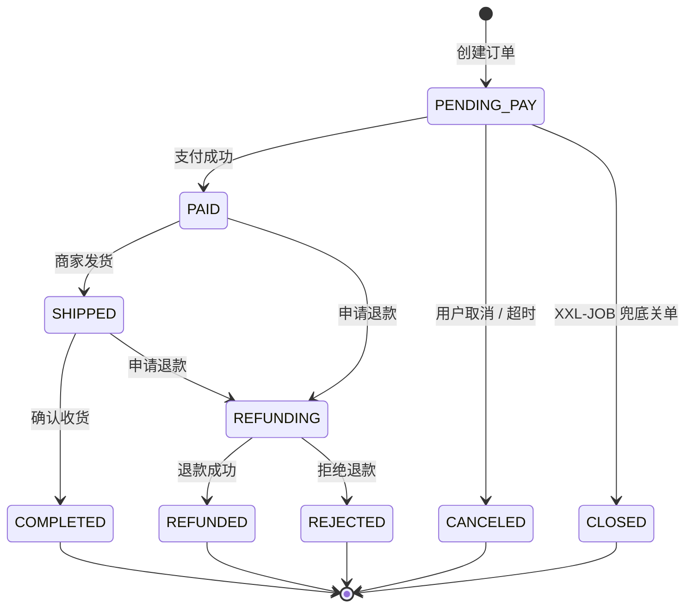
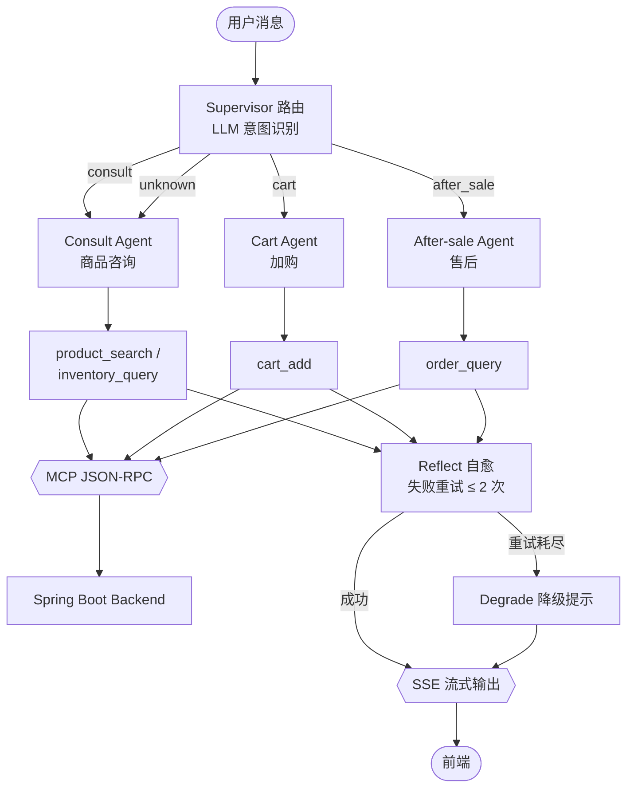
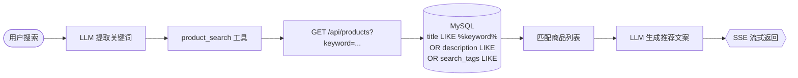
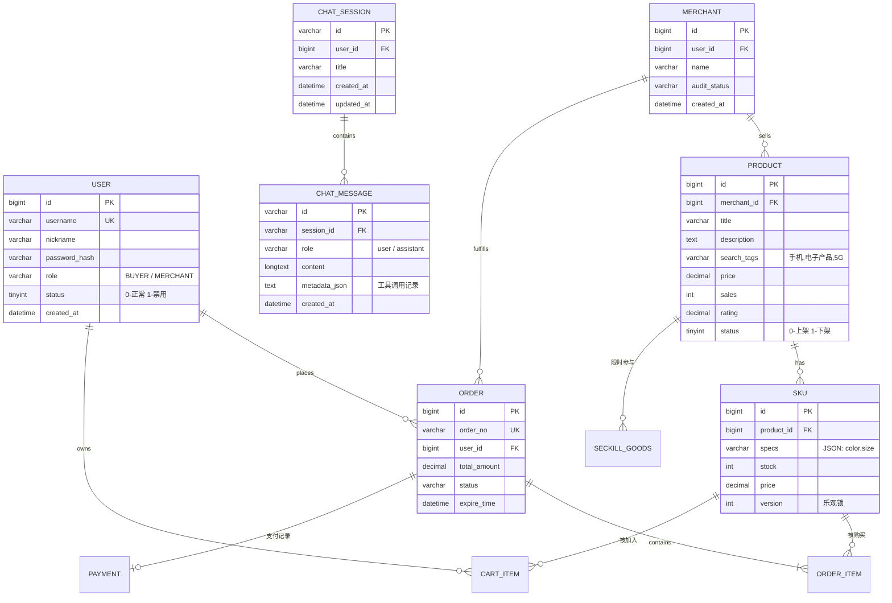

# 智能电商平台 + AI 导购助手

一个前后端分离的**智能电商平台** 单体 + 独立的 **AI 导购助手** 服务组成的 monorepo：

- **智能电商平台**：Vue 3 前端 + Spring Boot 3 后端，覆盖用户/商户双角色、商品、购物车、订单、支付、秒杀、商家入驻、AI 对话管理。
- **AI 导购助手**：Python（FastAPI + LangGraph）多 Agent 服务，通过 MCP 协议调用电商后端，提供商品咨询 / 加购 / 售后能力，SSE 流式输出。

---

## 技术栈

| 层 | 智能电商平台 | AI 导购助手 |
| --- | --- | --- |
| 前端 | Vue 3 + Vite + TypeScript + Pinia + Element Plus | （与前端共用） |
| 后端框架 | Spring Boot 3.x + Spring Security 6 + MyBatis-Plus | FastAPI 0.115+ + LangGraph |
| 数据库 | MySQL 8 + Redis 7 + Redisson | 同左（通过 HTTP 调用后端 CRUD） |
| 消息 / 异步 | RabbitMQ + XXL-JOB | asyncio 异步任务 |
| AI 编排 | — | LangGraph + LangChain + Tool Calling |
| 检索 / 记忆 | — | RAG（向量库）+ 短期 / 长期记忆 |
| 流式响应 | — | SSE（Server-Sent Events） |
| 部署 | Docker + docker-compose | 同左 |

---

## 系统架构

### 总体分层架构



> - AI 服务通过 **MCP 协议**（JSON-RPC over HTTP）调用 Spring Boot 后端的商品/订单/库存接口，不重复实现业务逻辑。
> - 前端通过 **Vite proxy** 将 `/api/*` 转发到后端（:8080），`/api/v1/chat` 转发到 AI 服务（:8000）。
> - AI 流式输出使用 **SSE**（Server-Sent Events），轻量、自动重连、代理友好。

### 后端（Java）模块架构

按 **feature-first** 划分业务模块；`common` / `config` / `infra` 为横切关注点。



### 订单状态机



### AI 多 Agent 路由工作流

一个 **Supervisor 路由智能体** + 三个**子链智能体**（Consult / Cart / After-sale）。Supervisor 用 LLM 做意图识别并分发；子链各自执行 MCP 工具调用（最多 3 轮 ReAct），返回结果后进入 **Reflect 自愈** 节点（检测失败→重试，达上限→优雅降级），最终通过 SSE 流式返回前端。



> - Supervisor 判断为 unknown（无关消息）时，默认交给 Consult Agent 兜底处理。
> - Reflect 节点检测工具调用失败后自动重试（最多 2 次），仍失败则走 Degrade 降级给出友好提示。
> - 所有子链调用结束后，对话记录通过 `BackendClient` 异步写入 Java 后端持久化。

### 商品搜索语义增强



商品通过 `search_tags` 字段支持同义词/类目级搜索。上架新商品时，LLM 自动根据标题和描述生成标签（`POST /api/v1/tools/generate-tags`），无需商家手动填写。

### 核心 ER 关系



---

## 目录结构

```
.
├── backend/                  Spring Boot 3 后端 (Java 17)
│   ├── src/main/java/com/ecommerce/
│   │   ├── common/           响应体、异常、枚举
│   │   ├── config/           安全、Redis、RabbitMQ、MyBatis-Plus
│   │   ├── infra/            JWT、鉴权过滤器、UserContext
│   │   └── modules/          业务模块 (feature-first)
│   │       ├── auth/         登录/注册/Token刷新
│   │       ├── chat/         对话会话/消息 CRUD
│   │       ├── product/      商品搜索/详情/SKU (含 AI 标签生成客户端)
│   │       ├── cart/         购物车
│   │       ├── order/        订单/状态机
│   │       ├── payment/      支付记录
│   │       ├── seckill/      秒杀 (Redis + Lua)
│   │       └── merchant/     商家入驻/审核
│   ├── src/main/resources/   application.yml / dev / prod
│   └── pom.xml
├── ai-assistant/             Python AI 导购助手 (FastAPI + LangGraph)
│   ├── app/
│   │   ├── main.py           FastAPI 入口
│   │   ├── core/             配置 / 日志 / 安全
│   │   ├── api/v1/           路由 (chat / tools / health)
│   │   ├── agents/           LangGraph 编排
│   │   │   ├── graph.py      工作流图定义
│   │   │   ├── supervisor.py Supervisor 节点
│   │   │   └── nodes/        consult / cart / after_sale / reflect / degrade
│   │   ├── tools/            MCP 工具层 (product_search / order / inventory)
│   │   ├── llm/              LLM 客户端 + Prompt（含 tag_generator）
│   │   ├── memory/           短期 / 长期记忆 (Redis)
│   │   ├── rag/              检索增强
│   │   ├── schemas/          Pydantic 模型
│   │   └── services/         后端 HTTP 客户端
│   ├── .env                  环境变量（LLM API Key 等）
│   └── requirements.txt
├── frontend/                 Vue 3 前端
│   ├── src/
│   │   ├── api/              axios 实例 + 按模块 API 客户端
│   │   ├── stores/           Pinia 状态 (user / cart / theme)
│   │   ├── router/           路由 + 守卫
│   │   ├── views/            页面级组件 (Chat / Home / Login / Search / ...)
│   │   ├── components/       通用组件
│   │   └── types/            全局类型
│   └── vite.config.ts
├── docs/
│   └── mysql-schema.sql      全量建库建表 DDL + 演示种子数据
└── docker-compose.dev.yml    本地 MySQL/Redis/RabbitMQ/Milvus/XXL-JOB
```

---

## 本地快速开始

**前置**：JDK 17、Node.js ≥ 20.x、Python 3.11+、Docker Desktop。

```bash
# 1. 启动基础设施 (MySQL / Redis / RabbitMQ / Milvus / XXL-JOB)
docker compose -f docker-compose.dev.yml up -d

# 2. 初始化数据库（导入表结构 + 种子数据）
#    使用任意 MySQL 客户端执行 docs/mysql-schema.sql
#    或通过 Spring Boot 启动后自动建表（Flyway 已禁用，需手动导入）

# 3. 后端 Spring Boot（监听 :8080, Swagger: /swagger-ui.html）
cd backend
mvn spring-boot:run -Dspring-boot.run.profiles=dev
#    如使用 IntelliJ IDEA：直接运行 EcommerceApplication.java

# 4. AI 助手 Python（API :8000, 文档: /docs, 健康检查: /api/v1/health）
cd ai-assistant
python -m venv .venv
# Windows: .venv\Scripts\activate
# Linux/Mac: source .venv/bin/activate
pip install -r requirements.txt
# 确保 .env 文件已配置 LLM API Key（参考 .env 模板）
uvicorn app.main:app --reload --port 8000

# 5. 前端 Vue 3（→ http://localhost:5173）
cd frontend
npm install
npm run dev
```

### 测试账号

| 角色 | 用户名 | 密码 |
| --- | --- | --- |
| 买家 | `zhangsan` | `123456` |
| 买家 | `lisi` | `123456` |
| 买家 | `wangwu` | `123456` |
| 商户（华为） | `merchant_01` | `123456` |
| 商户（小米） | `merchant_02` | `123456` |
| 禁用账号（验证禁用提示） | `zhaoliu` | `123456` |

---

## 认证与角色体系

- **入口即登录**：除 `/login` 外所有页面均 `requiresAuth`，未登录跳转至登录页。
- **登录页合一**：支持「登录 / 注册」Tab 切换；登录前选择「商户 / 买家」角色；注册分商户/买家表单，成功后自动登录。
- **角色守卫**：角色不匹配时自动跳转至对应首页（商户 → `/merchant/dashboard`，买家 → `/`）。
- **JWT 鉴权**：access token（15min）写入 `role` 声明 + refresh token（7day）；前端 axios 拦截器自动注入 `Authorization` 头，401 时自动刷新。

---

## API 规范

### 统一响应体

```json
{ "code": 0, "message": "ok", "data": { }, "traceId": "abc123" }
```

- 成功 `code = 0`；分页响应 `data` 含 `list / total / page / pageSize`。
- 失败 `code != 0`，前端拦截器统一弹窗提示。
- AI 对话（SSE）不经过此响应体，直接通过 `data:` 行流式传输 JSON 事件。

### 错误码体系

| 范围 | 含义 |
| --- | --- |
| `0` | 成功 |
| `1xxx` | 通用错误（参数 / 系统） |
| `2xxx` | 鉴权 / 权限 |
| `3xxx` | 商品 / 库存 |
| `4xxx` | 订单 / 支付 |
| `5xxx` | 商家 / 入驻 |
| `10xxx` | AI 服务专属 |
| `99999` | 系统兜底 |

常见：`1001` 参数校验失败、`2001` 未登录/Token 失效、`2002` 无权限、`2003` 账号已禁用、`3002` 库存不足、`4001` 订单状态不允许。

### 鉴权

- 登录下发 **access token (15min) + refresh token (7day)**；请求头 `Authorization: Bearer <access_token>`。
- 401 时前端用 refresh token 换新 access token，失败跳登录页。
- 跨服务调用（AI → 后端）使用 `X-Service-Token` 共享密钥鉴权。

### 核心 API 清单

| 模块 | 方法 | 路径 | 说明 |
| --- | --- | --- | --- |
| 认证 | POST | `/api/auth/login` | 登录 |
| 认证 | POST | `/api/auth/refresh` | 刷新 token |
| 认证 | GET | `/api/auth/me` | 当前用户 |
| 商品 | GET | `/api/products` | 搜索（关键词 / 分类 / 排序） |
| 商品 | GET | `/api/products/{id}` | 详情（含 SKU） |
| 商品 | GET | `/api/products/hot` | 热门推荐 |
| 购物车 | GET | `/api/cart` | 购物车列表 |
| 购物车 | POST | `/api/cart/items` | 加购 |
| 订单 | POST | `/api/orders` | 创建订单 |
| 订单 | POST | `/api/orders/{id}/cancel` | 取消 |
| 订单 | POST | `/api/orders/{id}/pay` | 支付 |
| 秒杀 | POST | `/api/seckill/{skuId}` | 秒杀（Redis + Lua） |
| 商家 | POST | `/api/merchant/apply` | 入驻申请 |
| 商家 | POST | `/api/merchant/audit` | 审核 |
| AI | POST | `/api/v1/chat` | 对话（SSE 流式） |
| AI | POST | `/api/v1/chat/stop` | 中断对话 |
| AI | GET | `/api/v1/chat/sessions` | 历史会话列表 |
| AI | GET | `/api/v1/tools/generate-tags` | AI 生成商品标签 |
| AI | GET | `/api/v1/health` | 健康检查 |

### SSE 事件格式

AI 对话 SSE 流中 `data:` 行携带的 JSON 事件类型：

| 类型 | 说明 |
| --- | --- |
| `token` | 增量文本，前端逐块追加渲染 |
| `tool_call` | 工具调用信息，前端展示 tool-chips |
| `error` | 服务异常信息 |
| `done` | 对话完成，携带 messageId |

---

## 代码规范

### Git Flow

```
main (生产, 受保护) ← develop (集成, 受保护)
  ├── feature/<scope>-<desc>   功能开发
  ├── release/<version>        发布准备
  └── hotfix/<scope>-<desc>    紧急修复
```

- `main` / `develop` 禁止直接 push，须 PR + 至少 1 人 approve。
- 强制 Squash Merge；提交遵循 **Conventional Commits**：`feat` / `fix` / `refactor` / `perf` / `test` / `docs` / `style` / `chore`。

### 分层约束（后端）

- `controller` 仅解析参数、调 service、返回响应；`service` 持有业务规则；`entity` 不出 service，对外一律 DTO。
- 外部调用（DB / Redis / HTTP）须捕获异常并转为 `BusinessException`；统一 SLF4J + 结构化日志（含 `traceId`）。
- `@Transactional` 只加在 service 方法上；禁止循环内 SQL / RPC、禁止 `select *`、禁止直接返回 entity。

### 必须遵守（前端 / Python AI）

- **前端**：Composition API + `<script setup lang="ts">`；Props / Emits 显式类型，禁止 `any`；API 调用只走 `src/api/modules/*`；路由懒加载。
- **Python AI**：外部 IO 全异步 `async def`；Pydantic 模型显式 `Field`；Agent 节点单一职责；Tool 统一 `BaseTool` 接口；所有 LLM 调用走 `app/llm/client.py`。

### Code Review 关注点

可读性 · 可测试性 · 边界（空 / null / 并发 / 网络）· 性能（N+1 / 全表扫）· 安全（注入 / XSS / 越权）· 可观测 · 可演进。

---

## 已知问题与安全建议

1. **refreshToken 存于 `localStorage`**：易遭 XSS 窃取，建议改 `httpOnly + Secure` Cookie。
2. **登录 / 注册无限流**：存在账号枚举与暴力破解风险，建议加 IP / 账号级限流。
3. **`logout` 为 no-op**：token 未服务端失效，建议加黑名单或短有效期 + 刷新吊销。
4. **前端 `vue-tsc` 既有类型错误**：`main.ts`、`theme.ts`、`user.ts`、`Cart.vue`、`Search.vue` 等，与业务修复无关，需另行处理。

---

## 数据库 Schema

完整的建库建表 DDL（用户 / 商家 / 商品 / SKU / 秒杀 / 订单 / 订单项 / 购物车 / 支付 / AI 会话与消息）及演示种子数据见 **[`docs/mysql-schema.sql`](docs/mysql-schema.sql)**。

> 该文件放在 `docs/` 目录下，作为完整的数据库参考和手动建库使用。初次使用时在 MySQL 中执行该文件即可完成建库、建表和数据初始化。
